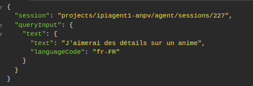
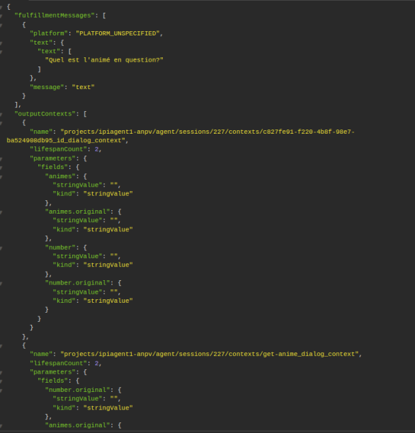
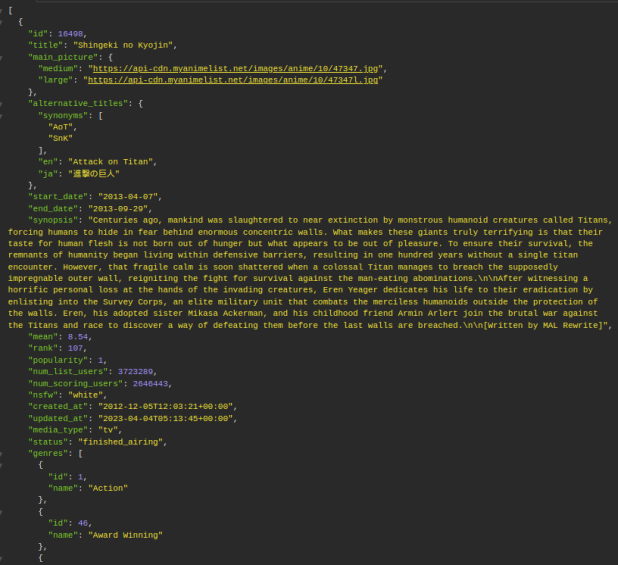
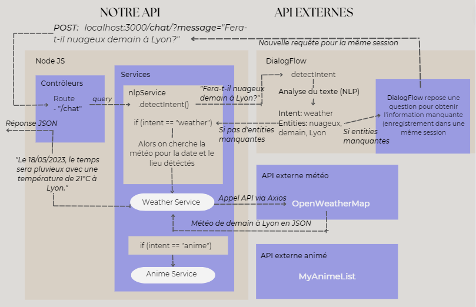

# APIs NodeJs: Météo et animé
#### *Projet étudiant (Chan, Dedola, Paiva)*
##### *Cette application est une API chatbot, permettant de converser sur les sujets suivants:*
 *- La météo*
 
 *- Les animés*

###### Serveur Node.js

- **Infrastructure d'application web** : Framework Node.js (v14.16.0) -\> Express
 Serveur web Express disponible sur le port local par défaut: **3000**
 
###### Librairies
 
 - **Librairie intégrée google-cloud** : storage, dialogflow
 
 - **Autres librairies** : body-parser, moment, axios
 
 - **APIs externes** : weatherApi-> openWeather, animeApi -> MyAnimeList

###### DialogFlow

- Pour que l'API fonctionne, il faut connecter l'ID projet de Dialogflow. Dans ce repo, nous utilisons notre ID project
pour que cela fonctionne et connecter nos **Intents** et **Entités**.

###### Fonctionnement

- **Lancement de l'application** : 

            clôner le projet, npm install, node index.js

*Pour intéragir avec l'API chatbot, il faut utiliser une application de type Postman ou Insomnia.*
                        
- **Appel sur l'endpoint '/chat' au travers de requête HTTP du type:**

        Endpoint -> 'http://localhost:3000/chat/'

        Requête -> POST

        Body -> message: texte en entrée de l'utilisateur

        Format -> application/x-www-form-urlencoded

    

- **Type et format de réponses de l'API:** 

  - *En cas d'informations données par l'utilisateur incomplètes:*
  
  
  
   - *En cas d'informations données par l'utilisateur complètes:*
   
  

*Réponse proposée via la détection d'entités et d'intent DialogFlow, et les APis externes.*

##### Si l'Intent détecté est :

 ###### Weather: 
 - Si il manque une des entités ('condition météo', 'lieu' ou 'date'):
      Le chatBot demande les informations manquantes.
 
 - Quand le chatbot possède toutes les entités nécessaires:
        Le chatbot fourni la météo pour la date et le lieu détectés.
 
 ###### Animé:
 - Si il manque l'entité 'nom de l'animé':
      le chatBot demande l'information manquante.
 
 - Quand le chatbot possède l'entité nécessaire:
        le chatbot fourni les informations détaillés pour l'animé détécté.

##### Schéma technique

                                     

                        
